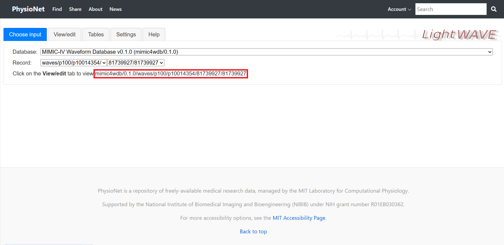
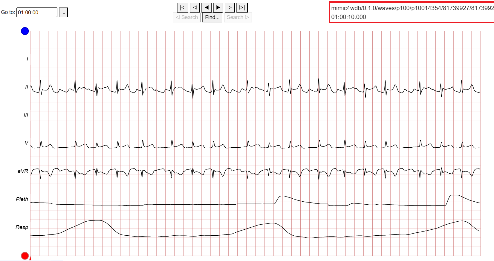

# Online WFDB Viewer
I made this in a week for a university (pending) paper, since I couldn't find any GUI's to read the signal directly online without the need to download the WFDB file.
It's a basic GUI to view and read simple properties of WFDB signals online without the need to download the file. 
I'll see if I can turn it into an exe so that it would be easier for anyone who needs it.


# Online Waveform Database Signal Viewer

This application is a tool designed for visualizing waveform signals from online databases, specifically tailored for medical waveform data like ECG. It is built with Python and PyQt5, providing a graphical interface for users to input parameters, view, and analyze waveform data.

## Prerequisites

Before running this application, ensure you have the following installed:

- Python 3.x
- PyQt5
- Matplotlib
- Numpy
- Scipy
- Pandas
- WFDB

You can install the required packages with the following command:

```bash
pip install pyqt5 matplotlib numpy scipy pandas wfdb
```

## Installation

Clone the repository to your local machine:

```bash
git clone https://github.com/mahdyyahoo/online-wfdb-viewer.git
cd online-wfdb-viewer
```

## Usage

Just run the .py script

```bash
python GUI_Online_signal_viewer.py
```

The preview is a simple sine wave, if you hit the "Update" button once it will read a WFDB from Physionet MIMIC-IV.
For any signal you just need to have the WFDB address,Just make sure the three address bars combined would lead to the address of the signal.
Then you can change the waveform you want to see using the drop-down menu.
By doing two clicks you can see and then copy the amplitudes and times of the points and their time difference.
All the errors are described in the lower menu of the GUI, the app will not crash but things like VPNs etc might interfere which you can see the reason in the footer.


If you were not sure about the WFDB address you can check it using [Physionet Lightwave](https://physionet.org/lightwave/)




### If you see a blank plot it's probably because that part of the signal is empty, it's not a bug.

## Contributing

If you need to add anything, feel free to fork. I probably can't put more time on it.
Here's my email if you need it.

mahdyu1346@live.com

## License

This project is licensed under the MIT License - see the LICENSE.md file for details.

## Acknowledgments

Created under supervision or my professor Dr. Ahmadi at Shahid Beheshti University of Medical Sciences.
